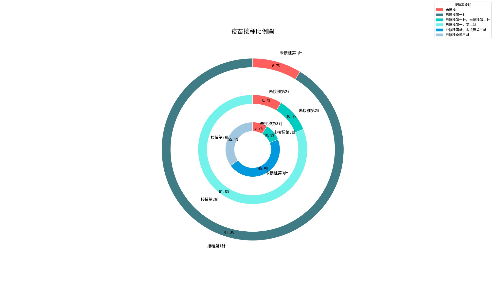

# 數據可視化toolkit

## CHP Data Processing

CHP dashboard數據請求和處理

### API

#### Dose接種

GET /covid-vaccine/summary.json?_=1646793071158 HTTP/1.1
Host: static.data.gov.hk

#### Case病例

GET /covid-19/data/keynum.json?_=1646793071152 HTTP/1.1
Host: chp-dashboard.geodata.gov.hk

### Chinese ref中文對照

#### Dose接種

|key|value|Chinese|
|---|---|---|
|firstDoseTotal|6095536|已接種第一針的人口|
|firstDosePercent|90.5%|第一針接種率|
|secondDoseTotal|5294053|已接種第二針的人口|
|secondDosePercent|78.6%|第二針接種率|
|thirdDoseTotal|2076960|已接種第三針的人口|
|latestDaily|78011|
|sevenDayAvg|77024|
|firstDoseDaily|19243|
|secondDoseDaily|17229|
|thirdDoseDaily|41539|
|totalDosesAdministered|13732150|疫苗接種劑次|
|age3to11FirstDose|251443|
|age3to11FirstDosePercent|47.7%
|age3to11SecondDose|14158|
|age3to11SecondDosePercent|2.7%

#### Case病例

|key|value|Chinese|
|---|---|---|
|OBJECTID|1|
|As_of_date|1646746560000|時間戳日期
|As_of_time|21:36|時間|
|Confirmed|525242|陽性檢測個案
|Hospitalised|8359|住院|
|PendingAdmission|0|
|Discharged|25054|
|Death|2578|死亡|
|UnderInvestigation|0|
|P_Confirmed|525242|陽性檢測個案|
|P_Hospitalised|8359|住院|
|P_PendingAdmission|0|
|P_Discharged|25054|
|P_Death|2578|死亡|
|P_UnderInvestigation|0|
|latitude|22.1827772|
|longitude|114.5993|
|Stable|0|
|P_Stable|0|
|Critical|69|深切治療|
|P_Critical|69|深切治療|
|Serious|0|
|P_Serious|0|
|LocalCasesAdded|28466|本地|
||ImportedCasedAdded|9|輸入|
|Confirmed2|226878|確診|
|Asymptomatic|105431|無症狀感染|
|RePositive|10|復陽|
|P_Confirmed2|None|
|P_Asymptomatic|None|
|P_RePositive|None|
|Local_Case2|28466|本地|
|Local_Case2_Related|0|
|Import_Case2|9|輸入|
|Import_case2_Related|0|
|P_Local_Case2|None|
|P_Local_Case2_Related|None|
|P_Import_Case2|None|
|P_Import_case2_Related|None|
|Confirmed_Delta|28475|陽性檢測個案之差|
|RAT_Positive|0|
|RAT_Positive_Delta|0|

### Use使用

`python3 chp-data.py`

環境: python 3.7+

運行結果：

部分數據示例


全部接種率餅圖示例



兒童接種率餅圖示例


## HA 服務需求高峰期重點數據

數據來源: https://data.gov.hk/tc-data/dataset/hospital-hadata-key-statistics-during-surge

### API

#### Time Stamp

GET /v1/historical-archive/list-file-versions?url=https://www.ha.org.hk/opendata/pas_report/Daily_Services_Statistics/Daily_Services_Statistics_TC.json&start=20220315&end=20220316 HTTP/1.1
Host: api.data.gov.hk


#### Statistics

https://api.data.gov.hk/v1/historical-archive/get-file?url=https://www.ha.org.hk/opendata/pas_report/Daily_Services_Statistics/Daily_Services_Statistics_EN.json&time=20220301-1107

### Use

```bash
$ python3 AH-statistics.py -h
Get statistics from HA. Data format: JSON.
param:
 -h	help.
 -l [TC|SC|EN]	language. TC: traditional Chinese. SC: simplified Chinese. EN: English. Default: EN.
 -s [YYYYMMDD]	start date.
 -e [YYYYMMDD]	end date.
```

**NOTICE: In mainland, vpn is needed**

部分運行結果

```
$python3 AH-statistics.py -s 20220311 -e 20220315
lang: EN
startDate: 20220311
endDate: 20220315
<class 'list'>
Downloading json file of timestamp  20220311-1115
Downloading json file of timestamp  20220312-1108
```
